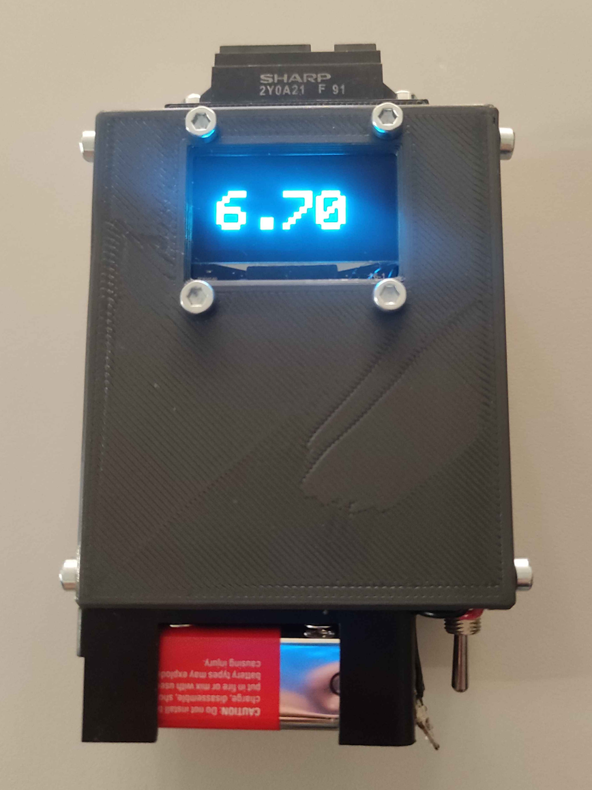

# Lap Timer for Line Follower Robots

  

## Purpose

This device functions as an automatic stopwatch for line follower robots.  
It detects when a robot passes a fixed point on the track and starts a timer without manual input. The system allows consistent and repeatable timing during testing, benchmarking, or competitions.

---

## How It Works

The timing gate monitors a detection zone using a IR sensor. When a object interrupts or passes through this zone, the system triggers a timer start event.

General operation flow:

1. Device is powered on and enters standby mode.
2. Sensor monitors the detection area.
3. Robot crosses the detection point.
4. Detection signal triggers the timer.
5. Time measurement continues until another trigger is received.

---

## How to Use

1. Place the timing gate at the desired start position on the track. Make sure its at least 5cm away from the line. By default the sensor will regrister anything within 115cm, so place a wall or something similar in front of the sensor where you want the detection range to end.
2. Power the device using the toggle switch.
4. For a faster boot up, hold something approximatly 5cm in front of the sensor. (but why would you want that ;) )
5. Start the robot run.
6. Record the measured time from the display.
7. The timer will automatically reset and start when the next run starts.

---

## Components

Example component list:

- ESP32-WROOM + Terminal Module
- SHARP 2Y0A21
- 1.3" OLED Display I2C
- 9V Battery + Holder
- Toggle Switch

## Future Improvements

- Detect faster objects
- Sensor stability
- Adjustable detection range
- Lower sensor height placement
